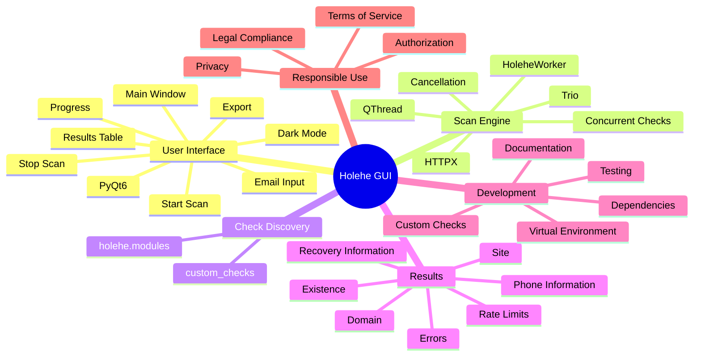

# Holehe GUI

> A native PyQt6 desktop interface for running [Holehe](https://github.com/megadose/holehe) email-presence checks with asynchronous execution, live results, cancellation, custom checks, and CSV/JSON export.

[](https://www.python.org/)
[](https://www.riverbankcomputing.com/software/pyqt/)
[](https://github.com/megadose/holehe)
[](LICENSE)

## Overview

Holehe GUI provides a graphical interface for the [Holehe](https://github.com/megadose/holehe) OSINT library. It replaces a terminal-only workflow with a desktop application for entering an email address, running supported checks, watching results arrive, cancelling an active scan, and exporting results.

## Features

- PyQt6 native desktop interface
- Asynchronous checks using QThread, Trio, and HTTPX
- Live result and progress updates
- Start/stop scan controls
- CSV and JSON export
- Dark mode
- Optional `custom_checks` extension package
- Error isolation so an individual failed check does not terminate the complete scan

## Responsible Use

Use this project only for authorized OSINT, security research, privacy auditing, defensive security, and educational purposes. Only check email addresses that you are authorized to investigate. Do not use it for harassment, stalking, unauthorized surveillance, account compromise, or unlawful collection of personal information. You are responsible for complying with applicable laws and third-party terms of service.

## Architecture

```text
User enters email
       |
       v
PyQt6 Main Window
       |
       v
HoleheWorker / QThread
       |
       +-------------------+
       |                   |
       v                   v
holehe.modules       custom_checks
       |                   |
       +---------+---------+
                 |
                 v
          Async HTTP checks
                 |
                 v
           Live results
              /    \
             v      v
          Display  Export
                   CSV/JSON
```

## Mind Map



## How It Works

`main.py` creates the Qt application and launches the main window. The GUI starts `HoleheWorker` in a background `QThread`. The worker runs a Trio event loop, discovers asynchronous check functions from `holehe.modules` and the optional `custom_checks` package, and executes them concurrently using an `httpx.AsyncClient`. Results and progress are emitted back to the GUI through Qt signals.

```text
START
  |
  v
Create HoleheWorker(email)
  |
  v
Start QThread
  |
  v
Start Trio runtime
  |
  v
Discover checks
  |---- holehe.modules
  |---- custom_checks
  |
  v
Create async HTTP client
  |
  v
Run checks concurrently
  |
  +---- resultReady ----> GUI
  |
  +---- progress -------> GUI
  |
  +---- stop ------------> cancellation scope
  |
  v
Finish scan
  |
  v
Review / Export
```

## Project Structure

```text
holehe_gui/
├── README.md
├── LICENSE
├── main.py
├── worker.py
├── export.py
├── requirements.txt
├── gui/
│   ├── __init__.py
│   └── main_window.py
└── custom_checks/
    └── __init__.py
```

## Requirements

The repository currently specifies:

```text
PyQt6>=6.6
holehe>=1.61
httpx>=0.24
trio>=0.22
```

Recommended: Python 3.10+ and an active internet connection for remote checks.

## Installation

### 1. Clone

```bash
git clone https://github.com/saeedjamalhussains/holehe_gui.git
cd holehe_gui
```

### 2. Create a virtual environment

Linux/macOS:

```bash
python3 -m venv .venv
source .venv/bin/activate
```

Windows PowerShell:

```powershell
python -m venv .venv
.venv\Scripts\activate
```

### 3. Install dependencies

```bash
python -m pip install --upgrade pip
pip install -r requirements.txt
```

## Running

```bash
python main.py
```

Enter an authorized email address, start the scan, monitor live results, and export them when required.

## Result Interpretation

Results may contain fields such as `name`, `domain`, `method`, `frequent_rate_limit`, `rateLimit`, `exists`, `emailrecovery`, `phoneNumber`, and `others` depending on the underlying check. A rate limit, network failure, or service change should not automatically be interpreted as evidence that an account does not exist.

## Custom Checks

The worker can discover local checks from `custom_checks` in addition to standard Holehe modules. A custom module should follow the asynchronous function conventions used by the installed Holehe version.

Conceptually:

```text
custom_checks/
├── __init__.py
└── example.py
        |
        +-- async check function
```

Recommended practices:

1. Keep checks asynchronous.
2. Use the provided HTTP client.
3. Follow Holehe result conventions.
4. Handle expected network failures.
5. Respect service rate limits and terms.
6. Avoid blocking the Trio event loop.

## Error Handling

Individual check failures are isolated so one service failure does not necessarily terminate the whole scan. Third-party services can rate-limit, block automation, change behavior, or become temporarily unavailable. Treat errors separately from negative observations.

## Export

`export.py` contains result export functionality. The current workflow supports CSV and JSON output. Future extensions could add Markdown, HTML, Excel, SQLite, or PDF reporting.

## Development

```bash
git clone https://github.com/saeedjamalhussains/holehe_gui.git
cd holehe_gui
python -m venv .venv
source .venv/bin/activate
pip install -r requirements.txt
python main.py
```

Before submitting changes, test startup, normal scans, progressive results, cancellation, failed checks, CSV/JSON export, dark mode, and custom-check discovery.

## Troubleshooting

### `ModuleNotFoundError`

Ensure the virtual environment is active and reinstall dependencies:

```bash
python -m pip install --upgrade pip
pip install -r requirements.txt
```

### Holehe import problems

Check the installed version:

```bash
pip show holehe
```

Then compare it with the version constraints in `requirements.txt`.

### No checks discovered

Possible causes include a broken Holehe installation, incompatible versions, import errors, or an invalid custom-check structure. Reinstall the dependencies and inspect Python import errors.

### Results contain errors

A result error can be caused by network failure, timeout, rate limiting, service unavailability, website changes, or anti-automation controls. It is not necessarily proof of a negative result.

## Privacy and Security

Email addresses and scan results may contain sensitive information. Do not commit real target data, do not publish private exports, protect generated CSV/JSON files, and remove sensitive test data before sharing screenshots or logs.

## Suggested Future Improvements

- Email input validation
- Result search, filtering, and sorting
- Configurable timeout and concurrency
- Scan history
- Structured logging
- Typed result models
- Automated tests and CI
- HTML/Markdown/PDF reports
- Secure local result storage and retention controls

## Contributing

Contributions are welcome. Keep changes focused, follow the existing architecture, avoid unnecessary dependencies, add tests where appropriate, update documentation when behavior changes, and never commit sensitive target data.

Suggested workflow:

```bash
git checkout -b feature/my-change
# make changes
git add .
git commit -m "Add: my change"
git push origin feature/my-change
```

Then open a Pull Request.

## Related Project

Holehe GUI is built around the [Holehe](https://github.com/megadose/holehe) OSINT library. Holehe is the underlying check engine; this repository provides the desktop GUI experience around it.

## Credits

- Holehe GUI: Shaik Saeed Jamal Hussain
- Holehe: megadose
- PyQt6: Qt Python bindings
- Trio: asynchronous concurrency framework
- HTTPX: asynchronous HTTP client

## License

This project is licensed under the **MIT License**. See [`LICENSE`](LICENSE) for the complete license text.

**SPDX-License-Identifier:** `MIT`

Copyright © 2026 **Shaik Saeed Jamal Hussain**.

## Disclaimer

This software is provided "AS IS" for legitimate security research, authorized OSINT, defensive security, privacy auditing, and educational use. The developers and contributors are not responsible for misuse of the software or actions performed against systems, services, or individuals without appropriate authorization. Always comply with applicable laws and third-party terms of service.

## Quick Start

```bash
git clone https://github.com/saeedjamalhussains/holehe_gui.git
cd holehe_gui
python -m venv .venv
source .venv/bin/activate
pip install -r requirements.txt
python main.py
```

**Enter an authorized email address → Start the scan → Review live results → Export if required.**
